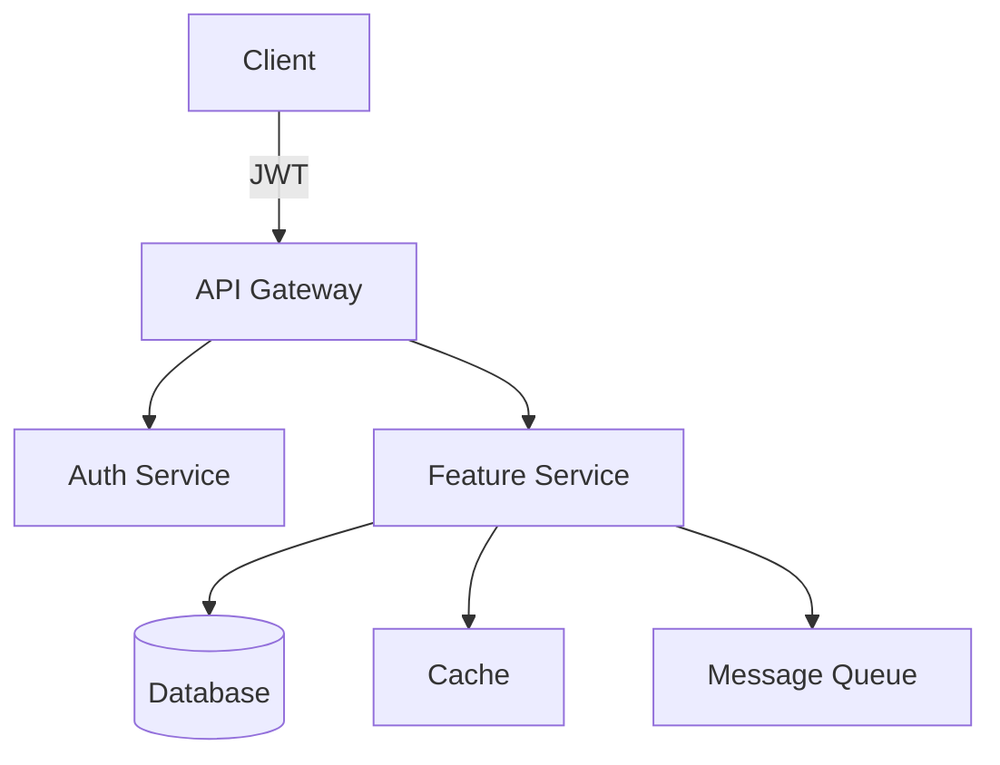

# PHASE_ORCHESTRATION.md - Research-First Multi-Persona Swarm Guide

## Overview

Each phase/feature requires comprehensive research and multi-perspective planning BEFORE implementation. This guide ensures your swarm creates GitHub issues that are complete technical specifications.

## Phase Documentation Structure

```
/docs/phases/
├── phase-x/
│   ├── README.md              # Phase overview
│   ├── research/              # Latest best practices
│   │   ├── openai-latest.md  # Current OpenAI models/APIs
│   │   ├── mcp-available.md  # Available MCP tools
│   │   ├── tech-stack.md     # Current best practices
│   │   └── security.md       # Latest security guidelines
│   ├── requirements/          # Business requirements
│   ├── architecture/          # Technical architecture
│   └── issues/               # Generated GitHub issues
```

## The Research-First Workflow

### Step 1: Research Current Best Practices

```bash
# Master prompt for research phase:
Think ultrahard about implementing [FEATURE]. First, spawn a research team:

@researcher investigate and document:
1. Latest OpenAI models and connection patterns (GPT-4o, GPT-4o-mini, pricing)
2. Available MCP tools from claude-flow (list all with examples)
3. Current best practices for [FEATURE TECHNOLOGY]
4. Security considerations and OWASP guidelines
5. Performance optimization techniques
6. Accessibility requirements

Save findings to /docs/phases/phase-x/research/
```

### Step 2: Multi-Persona Swarm Orchestration

```bash
# After research is complete, orchestrate the planning swarm:
Think harder: orchestrate a swarm to create a comprehensive GitHub issue for [FEATURE].

Spawn these personas simultaneously:
@product-owner define business value and user stories
@project-manager create timeline, dependencies, and risk assessment
@senior-developer design technical architecture and implementation plan
@test-writer create comprehensive test scenarios (unit, integration, E2E)
@frontend-expert design React component architecture and state management
@security-expert define security requirements and threat model

Synthesize all perspectives into a single, executable GitHub issue.
```

## Persona Definitions

### Core Personas (Always Present)

```yaml
# .claude/subagents/product-owner.yaml
name: product-owner
role: Business Value and User Experience
prompt: |
  You are a Product Owner with 10+ years experience. Focus on:
  - Clear user stories with acceptance criteria
  - Business value and ROI
  - User experience and accessibility
  - Success metrics and KPIs
  
  For each feature, provide:
  1. User stories in "As a... I want... So that..." format
  2. Acceptance criteria (Given/When/Then)
  3. Business justification
  4. Success metrics
```

```yaml
# .claude/subagents/project-manager.yaml
name: project-manager
role: Planning and Risk Management
prompt: |
  You are a Senior Project Manager. Provide:
  - Detailed task breakdown with time estimates
  - Dependencies and blockers
  - Risk assessment and mitigation
  - Resource requirements
  - Integration points with existing systems
  
  Always consider:
  1. Critical path analysis
  2. Parallel work opportunities
  3. Testing and deployment time
  4. Rollback strategies
```

```yaml
# .claude/subagents/senior-developer.yaml
name: senior-developer
role: Technical Architecture and Implementation
mcp_access: [supabase, filesystem, web_search]
prompt: |
  You are a Senior Developer with full-stack expertise. Create:
  - Detailed technical architecture
  - Implementation plan with pseudocode
  - Actual code snippets for critical parts
  - Database schema and API design
  - Performance considerations
  - Integration patterns
  
  Always include:
  1. Complete pseudocode for complex logic
  2. Actual code for critical functions
  3. Error handling patterns
  4. Logging and monitoring approach
```

```yaml
# .claude/subagents/test-writer.yaml
name: test-writer
role: Comprehensive Test Strategy
mcp_access: [playwright, filesystem]
prompt: |
  You are a Senior QA Engineer specializing in test automation. Create:
  - Complete test scenarios with expected results
  - Unit test specifications (with code)
  - Integration test plans
  - E2E test scripts (Playwright)
  - Performance test criteria
  - Security test cases
  
  Include actual test code examples:
  1. pytest unit tests
  2. Playwright E2E scripts
  3. Load testing scenarios
  4. Security penetration tests
```

### Feature-Specific Personas

```yaml
# .claude/subagents/frontend-expert.yaml
name: frontend-expert
role: React and UI/UX Architecture
prompt: |
  You are a Senior Frontend Engineer specializing in React. Provide:
  - Component hierarchy and structure
  - State management approach (Zustand/Redux)
  - Performance optimization strategies
  - Accessibility implementation
  - Responsive design approach
  
  Include:
  1. Component code structure
  2. Custom hooks implementation
  3. Performance optimization techniques
  4. CSS/styling approach
```

```yaml
# .claude/subagents/ml-expert.yaml
name: ml-expert
role: Machine Learning Implementation
prompt: |
  You are an ML Engineer. For AI features, provide:
  - Model selection and justification
  - Training data requirements
  - Inference optimization
  - Model versioning strategy
  - Performance metrics
  - Fallback mechanisms
```

## Enhanced GitHub Issue Template

```markdown
# [FEATURE]: Comprehensive Implementation Specification

## 📊 Business Context (Product Owner)

### User Stories
1. **As a** [user type] **I want** [feature] **so that** [benefit]
   - **Acceptance Criteria:**
     - Given [context]
     - When [action]
     - Then [expected result]

### Success Metrics
- Metric 1: [Description] (Target: X)
- Metric 2: [Description] (Target: Y)

### Business Value
- Revenue impact: [Estimate]
- User satisfaction: [Expected improvement]
- Competitive advantage: [Description]

---

## 📅 Project Planning (Project Manager)

### Timeline & Milestones
- Research & Design: 2 days
- Implementation: 5 days
- Testing: 3 days
- Deployment: 1 day

### Dependencies
1. [Dependency 1] - Status: ✅ Complete
2. [Dependency 2] - Status: 🔄 In Progress
3. [Dependency 3] - Status: ❌ Blocked

### Risk Assessment
| Risk | Probability | Impact | Mitigation |
|------|------------|---------|------------|
| [Risk 1] | High | Medium | [Mitigation strategy] |
| [Risk 2] | Low | High | [Mitigation strategy] |

---

## 🏗️ Technical Architecture (Senior Developer)

### System Design


### Implementation Plan

#### 1. Database Schema
```sql
-- Actual schema implementation
CREATE TABLE feature_data (
    id UUID PRIMARY KEY DEFAULT gen_random_uuid(),
    user_id UUID REFERENCES users(id),
    data JSONB NOT NULL,
    created_at TIMESTAMPTZ DEFAULT NOW(),
    updated_at TIMESTAMPTZ DEFAULT NOW()
);

-- Indexes for performance
CREATE INDEX idx_feature_user_id ON feature_data(user_id);
CREATE INDEX idx_feature_created_at ON feature_data(created_at DESC);

-- RLS Policies
ALTER TABLE feature_data ENABLE ROW LEVEL SECURITY;
CREATE POLICY "Users can view own data" ON feature_data
    FOR SELECT USING (user_id = auth.uid());
```

#### 2. API Implementation
```python
# Actual implementation code
from fastapi import FastAPI, Depends, HTTPException
from typing import Optional
import asyncio

@app.post("/api/feature")
async def create_feature(
    request: FeatureRequest,
    user: User = Depends(get_current_user),
    db: Database = Depends(get_db)
):
    # Input validation
    if not request.validate():
        raise HTTPException(400, "Invalid input")
    
    # Business logic with pseudocode
    """
    1. Validate user permissions
    2. Check rate limits
    3. Process feature data:
       - Transform input data
       - Apply business rules
       - Calculate derived fields
    4. Store in database with transaction
    5. Trigger async tasks
    6. Return response
    """
    
    # Actual implementation
    async with db.transaction():
        # Check permissions
        if not await user_has_permission(user.id, "feature.create"):
            raise HTTPException(403, "Insufficient permissions")
        
        # Rate limiting
        if await check_rate_limit(user.id, "feature_create", limit=10):
            raise HTTPException(429, "Rate limit exceeded")
        
        # Process and store
        processed_data = await process_feature_data(request.data)
        result = await db.feature_data.create({
            "user_id": user.id,
            "data": processed_data,
            "metadata": {
                "version": "1.0",
                "processing_time": time.time()
            }
        })
        
        # Async tasks
        await message_queue.publish("feature.created", result)
        
        return FeatureResponse(
            id=result.id,
            status="success",
            data=result.data
        )
```

#### 3. Integration with Latest OpenAI
```python
# Using latest OpenAI SDK (as of research date)
from openai import AsyncOpenAI

client = AsyncOpenAI(api_key=settings.OPENAI_API_KEY)

async def process_with_ai(content: str) -> str:
    response = await client.chat.completions.create(
        model="gpt-4o-mini",  # Latest efficient model
        messages=[
            {"role": "system", "content": "You are a helpful assistant."},
            {"role": "user", "content": content}
        ],
        temperature=0.7,
        max_tokens=1000
    )
    return response.choices[0].message.content
```

---

## 🧪 Test Specifications (Test Writer)

### Unit Tests
```python
# tests/test_feature.py
import pytest
from unittest.mock import Mock, patch

class TestFeatureAPI:
    @pytest.fixture
    def mock_user(self):
        return User(id="123", role="user")
    
    @pytest.mark.asyncio
    async def test_create_feature_success(self, mock_user):
        """Test successful feature creation"""
        request = FeatureRequest(data={"key": "value"})
        
        with patch('app.check_rate_limit', return_value=False):
            result = await create_feature(request, mock_user)
            
        assert result.status == "success"
        assert result.id is not None
    
    @pytest.mark.asyncio
    async def test_create_feature_rate_limit(self, mock_user):
        """Test rate limiting"""
        request = FeatureRequest(data={"key": "value"})
        
        with patch('app.check_rate_limit', return_value=True):
            with pytest.raises(HTTPException) as exc:
                await create_feature(request, mock_user)
            
        assert exc.value.status_code == 429
```

### E2E Tests (Playwright)
```javascript
// tests/e2e/feature.spec.ts
import { test, expect } from '@playwright/test';

test.describe('Feature E2E Tests', () => {
  test('complete feature workflow', async ({ page }) => {
    // Login
    await page.goto('/login');
    await page.fill('#email', 'test@example.com');
    await page.fill('#password', 'secure_password');
    await page.click('button[type="submit"]');
    
    // Navigate to feature
    await page.goto('/feature');
    await expect(page.locator('h1')).toContainText('Feature Dashboard');
    
    // Create new feature
    await page.click('button:has-text("Create New")');
    await page.fill('#feature-name', 'Test Feature');
    await page.fill('#feature-description', 'E2E Test Description');
    
    // Submit and verify
    await page.click('button:has-text("Submit")');
    await expect(page.locator('.success-message')).toBeVisible();
    await expect(page.locator('.feature-list')).toContainText('Test Feature');
  });
});
```

---

## 🎨 Frontend Implementation (Frontend Expert)

### React Component Architecture
```typescript
// components/Feature/FeatureContainer.tsx
import React, { useState, useEffect } from 'react';
import { useFeatureStore } from '@/stores/featureStore';
import { FeatureList } from './FeatureList';
import { FeatureDetail } from './FeatureDetail';
import { CreateFeatureModal } from './CreateFeatureModal';

export const FeatureContainer: React.FC = () => {
  const { features, loading, error, fetchFeatures } = useFeatureStore();
  const [selectedFeature, setSelectedFeature] = useState<Feature | null>(null);
  
  useEffect(() => {
    fetchFeatures();
  }, []);
  
  if (loading) return <FeatureSkeleton />;
  if (error) return <ErrorBoundary error={error} />;
  
  return (
    <div className="feature-container">
      <FeatureList 
        features={features}
        onSelect={setSelectedFeature}
      />
      {selectedFeature && (
        <FeatureDetail 
          feature={selectedFeature}
          onClose={() => setSelectedFeature(null)}
        />
      )}
      <CreateFeatureModal />
    </div>
  );
};
```

### State Management (Zustand)
```typescript
// stores/featureStore.ts
import { create } from 'zustand';
import { devtools, persist } from 'zustand/middleware';

interface FeatureState {
  features: Feature[];
  loading: boolean;
  error: Error | null;
  fetchFeatures: () => Promise<void>;
  createFeature: (data: CreateFeatureDTO) => Promise<void>;
}

export const useFeatureStore = create<FeatureState>()(
  devtools(
    persist(
      (set, get) => ({
        features: [],
        loading: false,
        error: null,
        
        fetchFeatures: async () => {
          set({ loading: true, error: null });
          try {
            const response = await api.features.list();
            set({ features: response.data, loading: false });
          } catch (error) {
            set({ error: error as Error, loading: false });
          }
        },
        
        createFeature: async (data) => {
          try {
            const response = await api.features.create(data);
            set(state => ({
              features: [...state.features, response.data]
            }));
          } catch (error) {
            set({ error: error as Error });
          }
        }
      }),
      { name: 'feature-store' }
    )
  )
);
```

---

## 🔒 Security Requirements (Security Expert)

### Threat Model
1. **Authentication Bypass**: Implement JWT with refresh tokens
2. **SQL Injection**: Use parameterized queries only
3. **XSS**: Sanitize all user inputs, use React's built-in protection
4. **CSRF**: Implement CSRF tokens for state-changing operations
5. **Rate Limiting**: Implement per-user and per-IP limits

### Security Implementation
```python
# Security middleware
from functools import wraps
import jwt
from datetime import datetime, timedelta

def require_auth(permissions: List[str] = None):
    def decorator(func):
        @wraps(func)
        async def wrapper(*args, **kwargs):
            token = request.headers.get('Authorization', '').replace('Bearer ', '')
            
            try:
                payload = jwt.decode(token, settings.JWT_SECRET, algorithms=['HS256'])
                user = await get_user(payload['user_id'])
                
                if permissions:
                    if not any(perm in user.permissions for perm in permissions):
                        raise HTTPException(403, "Insufficient permissions")
                
                return await func(*args, user=user, **kwargs)
            except jwt.ExpiredSignatureError:
                raise HTTPException(401, "Token expired")
            except Exception:
                raise HTTPException(401, "Invalid token")
        
        return wrapper
    return decorator
```

---

## 🚀 MCP Tools Integration

### Available MCP Tools (from research)
```yaml
# Currently available in claude-flow
supabase:
  - Database operations
  - Real-time subscriptions
  - Storage management
  - Authentication

playwright:
  - Browser automation
  - E2E testing
  - Visual regression testing
  - Performance testing

fetch:
  - HTTP requests
  - API integration
  - Webhook handling

filesystem:
  - File operations
  - Directory management
  - File watching

github:
  - Issue management
  - PR automation
  - Code review

slack:
  - Notifications
  - Team communication
  - Alerts

linear:
  - Task tracking
  - Sprint planning
  - Bug reporting
```

### MCP Implementation Examples
```python
# Using Supabase MCP
@mcp.supabase
async def setup_feature_table():
    await supabase.create_table('features', {
        'id': 'uuid',
        'name': 'text',
        'data': 'jsonb',
        'created_at': 'timestamptz'
    })
    
    await supabase.create_policy('features', 'SELECT', 
        'user_id = auth.uid()')

# Using Playwright MCP
@mcp.playwright
async def test_feature_ui():
    browser = await playwright.chromium.launch()
    page = await browser.new_page()
    await page.goto('http://localhost:3000/feature')
    await page.screenshot(path='feature-test.png')
```

---

## ✅ Definition of Done

### Code Quality
- [ ] All unit tests passing (>95% coverage)
- [ ] All integration tests passing
- [ ] All E2E tests passing
- [ ] Code review approved by senior developer
- [ ] No security vulnerabilities (OWASP scan clean)
- [ ] Performance benchmarks met (<100ms response time)

### Documentation
- [ ] API documentation complete
- [ ] Component documentation with examples
- [ ] Architecture decision records (ADRs) updated
- [ ] User guide created

### Deployment
- [ ] Feature flags configured
- [ ] Monitoring and alerts set up
- [ ] Rollback plan tested
- [ ] Performance metrics baseline established

---

## 🎯 Success Metrics Tracking

```python
# Metrics implementation
from prometheus_client import Counter, Histogram, Gauge

feature_created = Counter('feature_created_total', 
    'Total features created')
feature_latency = Histogram('feature_latency_seconds',
    'Feature operation latency')
active_features = Gauge('active_features',
    'Number of active features')

@track_metrics
async def create_feature_with_metrics(request):
    with feature_latency.time():
        result = await create_feature(request)
    
    feature_created.inc()
    active_features.inc()
    
    return result
```

---

## 🔄 Continuous Improvement

After implementation, schedule retrospective with all personas to:
1. Review what worked well
2. Identify improvements
3. Update templates and patterns
4. Share learnings with team
```

## Master Orchestration Prompt Template

```bash
# Use this template for every new feature/phase:

Think ultrahard about implementing [FEATURE NAME] for [PHASE X]. 

First, research current best practices:
@researcher investigate and document:
1. Latest OpenAI models and connection patterns (current pricing, rate limits)
2. Available MCP tools from claude-flow with usage examples
3. Current [TECHNOLOGY] best practices and patterns
4. Security requirements for [FEATURE TYPE]
5. Performance benchmarks and optimization techniques

Save all findings to: /docs/phases/[phase-x]/research/

Then orchestrate a comprehensive planning swarm:
@product-owner define user stories, acceptance criteria, and success metrics
@project-manager create timeline, identify dependencies and risks
@senior-developer design technical architecture with pseudocode and code snippets
@test-writer create comprehensive test specifications with actual test code
@[feature-specific-expert] provide specialized implementation details
@security-expert define threat model and security requirements

Synthesize all perspectives into a single GitHub issue following the template at:
/docs/phases/PHASE_ORCHESTRATION.md#enhanced-github-issue-template

The issue must be completely self-contained and executable by implementation agents.
Include:
- Complete context and business justification
- Full technical architecture with diagrams
- Actual code snippets for critical components
- Complete test specifications with code
- Security requirements and implementation
- Definition of Done with measurable criteria
```

## Integration with Existing Workflow

1. **Create phase folder structure** before starting
2. **Run research phase first** to get latest information
3. **Orchestrate multi-persona swarm** for comprehensive planning
4. **Generate ultra-detailed GitHub issue** that's self-contained
5. **Execute implementation** with TDD sub-agents
6. **Validate against DoD** before closing

This approach ensures every feature is:
- Based on latest best practices
- Viewed from multiple expert perspectives
- Documented as executable specifications
- Implemented with quality and security first