# EPIC_BREAKDOWN_EXAMPLES.md - Epic Decomposition Patterns

## 🎯 When to Create an Epic

```python
# Decision algorithm
def requires_epic(feature):
    if any([
        feature.estimated_days > 3,
        feature.sub_components > 3,
        feature.cross_team_coordination,
        feature.multiple_deployment_phases,
        feature.breaking_changes
    ]):
        return True
    return False
```

## 📊 Epic Breakdown Patterns

### Pattern 1: Vertical Slices (Recommended)

Each issue is a complete, deployable feature slice.

```bash
# Example: E-Commerce Platform
EPIC: "E-Commerce Platform"
├── Issue #1: "User Registration & Authentication"
│   ├── Complete auth flow (frontend + backend)
│   ├── Database tables
│   ├── Tests (unit, integration, E2E)
│   └── Can deploy independently
├── Issue #2: "Product Catalog & Search"
│   ├── Complete product management
│   ├── Search functionality
│   ├── Tests
│   └── Can deploy independently
├── Issue #3: "Shopping Cart & Checkout"
│   ├── Cart functionality
│   ├── Payment integration
│   ├── Tests
│   └── Can deploy independently
└── Issue #4: "Order Management & History"
    ├── Order processing
    ├── User order history
    ├── Tests
    └── Can deploy independently

# Create epic
gh issue create --title "[EPIC] E-Commerce Platform" --body "$(cat << 'EOF'
# Epic: E-Commerce Platform

## Vertical Slices (Each Independently Deployable)

### Issue #1: User Registration & Authentication
**Agents**: 6 (researcher, planner, tester, backend-coder, frontend-coder, reviewer)
**Token Budget**: 400k
**Timeline**: 2 days
**Dependencies**: None

### Issue #2: Product Catalog & Search  
**Agents**: 8 (includes search-specialist, db-optimizer)
**Token Budget**: 600k
**Timeline**: 3 days
**Dependencies**: Issue #1 (for user context)

### Issue #3: Shopping Cart & Checkout
**Agents**: 10 (includes payment-specialist, security-expert)
**Token Budget**: 800k
**Timeline**: 4 days
**Dependencies**: Issues #1, #2

### Issue #4: Order Management & History
**Agents**: 6
**Token Budget**: 400k
**Timeline**: 2 days
**Dependencies**: Issues #1, #2, #3

## Total Resources
- **Timeline**: 11 days (with some parallel work)
- **Total Tokens**: 2.2M
- **Estimated Cost**: $22
- **Total Agents**: 30 (some reused across issues)
EOF
)"

# Create individual issues with full specifications
for issue in 1 2 3 4; do
    @planner create issue #$issue with complete implementation details following SWARM_EXECUTION_GUIDE.md
done
```

### Pattern 2: Horizontal Layers (When Required)

Sometimes you need to build infrastructure first.

```bash
# Example: Real-time Analytics Dashboard
EPIC: "Real-time Analytics Dashboard"
├── Issue #1: "Data Pipeline Infrastructure"
│   ├── Kafka setup
│   ├── Stream processing
│   ├── Data warehouse schema
│   └── Not user-facing
├── Issue #2: "Backend API Layer"
│   ├── WebSocket server
│   ├── REST endpoints
│   ├── Caching layer
│   └── Not user-facing
├── Issue #3: "Frontend Dashboard Components"
│   ├── Chart components
│   ├── Real-time updates
│   ├── Responsive design
│   └── Requires #1 and #2
└── Issue #4: "Integration & Performance"
    ├── Connect all layers
    ├── Optimize queries
    ├── Add monitoring
    └── Final deployment

# Parallel execution plan
graph LR
    Issue1[Data Pipeline] --> Issue3[Frontend]
    Issue2[Backend API] --> Issue3
    Issue3 --> Issue4[Integration]
    Issue1 -.-> |parallel| Issue2
```

### Pattern 3: Feature Flags Approach

Build everything but release incrementally.

```bash
# Example: AI-Powered Search
EPIC: "AI-Powered Search System"
├── Issue #1: "Basic Search Infrastructure"
│   ├── Elasticsearch setup
│   ├── Basic text search
│   ├── Feature flag: basic_search
│   └── Deploy immediately
├── Issue #2: "AI Enhancement Layer"
│   ├── OpenAI integration
│   ├── Semantic search
│   ├── Feature flag: ai_search (default: off)
│   └── Deploy but hidden
├── Issue #3: "User Personalization"
│   ├── User preference learning
│   ├── Personalized results
│   ├── Feature flag: personalized_search
│   └── Deploy to beta users
└── Issue #4: "Advanced Analytics"
    ├── Search analytics
    ├── A/B testing framework
    ├── Feature flag: search_analytics
    └── Deploy to admins only

# Feature flag configuration
feature_flags:
  basic_search:
    rollout: 100%
    launch: "immediate"
  ai_search:
    rollout: 0% → 10% → 50% → 100%
    launch: "week 2"
  personalized_search:
    rollout: "beta_users → 25% → 100%"
    launch: "week 3"
  search_analytics:
    rollout: "admins → internal → 100%"
    launch: "week 4"
```

## 🔄 Epic Coordination Patterns

### Master Swarm Configuration

```yaml
# .claude/epic-config.yml
epic_coordination:
  master_swarm:
    name: "epic-coordinator"
    agents:
      - epic-planner      # Breaks down epic
      - dependency-tracker # Manages issue dependencies
      - resource-allocator # Distributes token budgets
      - timeline-manager   # Schedules parallel work
      - risk-assessor      # Identifies blockers
    
  issue_swarms:
    template:
      base_agents: 6
      scale_factor: 1.5  # Multiply by complexity
      max_agents: 12
      parallel_limit: 5
    
  communication:
    method: "shared_memory"
    sync_interval: "after_each_phase"
    conflict_resolution: "epic-planner"
```

### Epic Execution Command

```bash
# One command to rule them all
execute_epic() {
    local EPIC_NAME=$1
    local EPIC_NUMBER=$2
    
    # Phase 1: Epic Planning
    @epic-planner analyze $EPIC_NAME and create breakdown
    
    # Phase 2: Create all issues
    local ISSUES=$(gh issue list --label "epic-$EPIC_NUMBER" --json number -q '.[].number')
    
    # Phase 3: Execute issues based on dependencies
    for ISSUE in $ISSUES; do
        local DEPS=$(gh issue view $ISSUE --json body -q '.body' | grep "Dependencies:" | cut -d: -f2)
        
        if [[ -z "$DEPS" ]] || all_completed "$DEPS"; then
            # Execute issue in background
            execute_issue $ISSUE &
        else
            # Wait for dependencies
            wait_for_dependencies "$DEPS"
            execute_issue $ISSUE &
        fi
    done
    
    # Wait for all issues
    wait
    
    # Phase 4: Integration testing
    @integration-tester test epic $EPIC_NUMBER completely
}

# Execute a single issue
execute_issue() {
    local ISSUE=$1
    echo "Executing issue #$ISSUE"
    
    # Standard flow from SWARM_EXECUTION_GUIDE.md
    @researcher investigate issue #$ISSUE requirements
    @planner coordinate 6 personas for issue #$ISSUE  
    @tester implement tests for issue #$ISSUE
    @coder implement issue #$ISSUE to pass tests
    @reviewer verify issue #$ISSUE quality
    
    # Mark complete
    gh issue close $ISSUE --comment "Completed by swarm execution"
}
```

## 📈 Resource Allocation for Epics

### Token Budget Distribution

```python
def allocate_epic_tokens(epic_size, num_issues):
    """
    Distribute token budget across epic issues
    """
    BASE_TOKENS = {
        "small": 500_000,      # $5
        "medium": 1_000_000,   # $10
        "large": 2_000_000,    # $20
        "xlarge": 5_000_000    # $50
    }
    
    total_tokens = BASE_TOKENS[epic_size]
    
    # Distribution strategy
    distribution = {
        "research": 0.10,       # 10% for research
        "planning": 0.15,       # 15% for planning
        "implementation": 0.50, # 50% for coding
        "testing": 0.20,        # 20% for testing
        "review": 0.05         # 5% for review
    }
    
    # Per-issue allocation
    tokens_per_issue = total_tokens // num_issues
    
    # Complexity multipliers
    complexity_multipliers = {
        "infrastructure": 1.5,
        "user_facing": 1.0,
        "integration": 1.3,
        "data_heavy": 1.4,
        "ai_ml": 1.6
    }
    
    return tokens_per_issue, distribution
```

### Parallel Execution Strategy

```mermaid
gantt
    title Epic Parallel Execution Plan
    dateFormat HH:mm
    section Research
    All Research    :r1, 00:00, 2h
    section Issue 1
    Planning 1      :p1, after r1, 1h
    Testing 1       :t1, after p1, 2h  
    Coding 1        :c1, after t1, 3h
    section Issue 2
    Planning 2      :p2, after r1, 1h
    Testing 2       :t2, after p2, 2h
    Coding 2        :c2, after t2, 3h
    section Issue 3
    Planning 3      :p3, after c1 c2, 1h
    Testing 3       :t3, after p3, 2h
    Coding 3        :c3, after t3, 3h
    section Integration
    Integration     :i1, after c3, 2h
```



## 🎯 Epic Success Patterns

### Pattern 1: Research Once, Use Many

```bash
# Do comprehensive research ONCE for the entire epic
@epic-researcher conduct exhaustive research for $EPIC_NAME:
- All technology choices
- All security considerations  
- All performance benchmarks
- All API documentation
- All best practices

# Save to shared location
/docs/epics/$EPIC_NAME/research/
├── technology-stack.md
├── security-matrix.md
├── performance-targets.md
├── api-documentation.md
├── best-practices.md
└── cost-analysis.md

# All issues reference this research
Issue #1: "Reference /docs/epics/$EPIC_NAME/research/"
Issue #2: "Reference /docs/epics/$EPIC_NAME/research/"
Issue #3: "Reference /docs/epics/$EPIC_NAME/research/"
```

### Pattern 2: Shared Components Library

```bash
# Create shared components early
Issue #1: "Shared Component Library"
├── UI components
├── Utility functions
├── API clients
├── Test helpers
└── Documentation

# Subsequent issues import
Issue #2: "import { Button, Form } from '@/shared/components'"
Issue #3: "import { apiClient } from '@/shared/clients'"
Issue #4: "import { testHelpers } from '@/shared/testing'"
```

### Pattern 3: Progressive Enhancement

```bash
# Start simple, enhance iteratively
Issue #1: "MVP - Basic Functionality"
├── Core features only
├── Simple UI
├── Basic tests
└── Deploy immediately

Issue #2: "Enhancement - Advanced Features"
├── Add complex features
├── Enhance UI/UX
├── Add comprehensive tests
└── Deploy with feature flags

Issue #3: "Optimization - Performance & Scale"
├── Performance optimizations
├── Caching layer
├── Load testing
└── Deploy gradually

Issue #4: "Polish - Final Touches"
├── Analytics
├── A/B testing
├── Documentation
└── Full rollout
```

## 📋 Epic Template Generator

```bash
# Generate epic breakdown automatically
generate_epic_breakdown() {
    local EPIC_NAME=$1
    local EPIC_DESC=$2
    local COMPLEXITY=$3  # small/medium/large/xlarge
    
    @epic-planner analyze:
    - Epic: $EPIC_NAME
    - Description: $EPIC_DESC
    - Complexity: $COMPLEXITY
    
    Output:
    1. Recommended number of issues
    2. Suggested breakdown pattern (vertical/horizontal/feature-flags)
    3. Resource allocation per issue
    4. Dependency graph
    5. Parallel execution plan
    6. Total timeline estimate
    7. Total cost estimate
    
    Save to: /docs/epics/$EPIC_NAME/breakdown.md
}

# Example usage
generate_epic_breakdown \
    "AI-Powered Customer Support" \
    "Build a complete AI customer support system with chat, ticket management, and analytics" \
    "large"
```

## 🚀 Quick Epic Commands

```bash
# Create epic with 4 issues
create_epic_with_issues() {
    # Create epic
    EPIC_NUM=$(gh issue create --title "[EPIC] $1" --label "epic" --body "$2" | grep -o '[0-9]\+')
    
    # Create 4 sub-issues
    for i in {1..4}; do
        gh issue create \
            --title "[$1] Part $i" \
            --label "epic-$EPIC_NUM,swarm" \
            --body "Part of epic #$EPIC_NUM"
    done
    
    echo "Created epic #$EPIC_NUM with 4 sub-issues"
}

# Execute entire epic
execute_full_epic() {
    local EPIC_NUM=$1
    
    # Get all issues for epic
    ISSUES=$(gh issue list --label "epic-$EPIC_NUM" --json number -q '.[].number')
    
    # Execute each issue
    for ISSUE in $ISSUES; do
        echo "Executing issue #$ISSUE"
        execute_standard_swarm_flow $ISSUE
    done
}

# Monitor epic progress
monitor_epic() {
    local EPIC_NUM=$1
    
    watch -n 30 "
        echo 'Epic #$EPIC_NUM Progress:'
        gh issue list --label 'epic-$EPIC_NUM' --json number,title,state
        echo ''
        echo 'Token Usage:'
        claude-flow report tokens --epic $EPIC_NUM
        echo ''
        echo 'Cost So Far:'
        claude-flow report cost --epic $EPIC_NUM
    "
}
```

---

**Remember**: Epics are for coordinating multiple related features. Each issue within an epic should be independently valuable and deployable. Use vertical slices whenever possible!