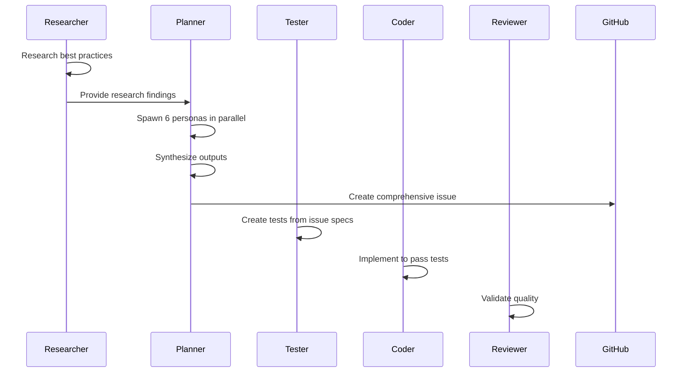

# Planning Agent Implementation Guide

Based on comprehensive research into multi-persona coordination, agile methodologies, and parallel agent techniques, this guide provides actionable strategies for creating a highly effective planning agent.

## Executive Summary

The planning agent should leverage **Solo Performance Prompting (SPP)** to coordinate 6 specialized personas working in parallel to create comprehensive GitHub issues. Each issue becomes an executable specification with complete context, code examples, and acceptance criteria.

## Architecture Overview

```mermaid
graph TD
    A[Planning Agent - Opus 4] -->|Spawns Parallel| B[Product Owner - Sonnet 4]
    A -->|Spawns Parallel| C[Project Manager - Sonnet 4]
    A -->|Spawns Parallel| D[Senior Developer - Sonnet 4]
    A -->|Spawns Parallel| E[Test Writer - Sonnet 4]
    A -->|Spawns Parallel| F[Frontend Expert - Sonnet 4]
    A -->|Spawns Parallel| G[Security Expert - Sonnet 4]
    
    B -->|Writes| H[/tmp/swarm/product-owner.md]
    C -->|Writes| I[/tmp/swarm/project-manager.md]
    D -->|Writes| J[/tmp/swarm/senior-developer.md]
    E -->|Writes| K[/tmp/swarm/test-writer.md]
    F -->|Writes| L[/tmp/swarm/frontend-expert.md]
    G -->|Writes| M[/tmp/swarm/security-expert.md]
    
    H & I & J & K & L & M -->|Synthesis| N[Comprehensive GitHub Issue]
```

## Implementation Strategy

### 1. Planning Agent Configuration

```yaml
# .claude/agents/planner.md
---
name: planner
type: coordinator
description: Creates comprehensive GitHub issues from multiple expert perspectives
tools: [file_read, file_write, github_cli, web_search]
context_budget: 200000
model: claude-opus-4  # Complex coordination requires Opus
sub_agents:
  - product-owner
  - project-manager
  - senior-developer
  - test-writer
  - frontend-expert
  - security-expert
spawn_strategy: parallel
coordination: wait_all_then_synthesize
output_format: github_issue_template
---
```

### 2. Master Orchestration Prompt

```markdown
You are an expert planning coordinator using Solo Performance Prompting (SPP) to create comprehensive GitHub issues. You coordinate 6 specialized personas working in parallel.

## Your Orchestration Process:

1. **Analyze Feature Request**
   - Understand the core requirements
   - Identify technical scope
   - Determine affected components

2. **Spawn All Personas Simultaneously**
   ```
   @product-owner define user stories, acceptance criteria, and business value
   @project-manager create timeline, identify dependencies, assess risks
   @senior-developer design architecture with pseudocode and code examples
   @test-writer create complete test specifications with actual test code
   @frontend-expert design UI components and state management
   @security-expert define threat model and security requirements
   ```

3. **Coordinate Outputs**
   - Each persona writes to /tmp/swarm/[persona-name].md
   - Wait for all personas to complete
   - Read and synthesize all outputs

4. **Generate Comprehensive Issue**
   - Follow the template in PHASE_ORCHESTRATION.md
   - Include actual code, not placeholders
   - Ensure all perspectives are integrated
   - Create executable specifications

## Key Instructions:

- **Parallel Execution**: Always spawn all 6 personas in ONE command
- **Complete Context**: Provide full feature details to each persona
- **Real Code**: Include actual implementation snippets, not pseudocode
- **BDD Format**: Use Given/When/Then for acceptance criteria
- **SMART Metrics**: Ensure all success metrics are measurable
- **Memory Storage**: Save important decisions and patterns
```

### 3. Persona Prompt Templates

#### Product Owner Persona
```markdown
You are a Product Owner with 15+ years experience in agile development. You excel at translating business needs into clear user stories.

For the given feature, provide:

1. **User Stories** (3-5 stories)
   ```
   As a [user type]
   I want [feature/action]
   So that [business value/outcome]
   ```

2. **Acceptance Criteria** (BDD format)
   ```gherkin
   Given [initial context]
   When [action is taken]
   Then [expected outcome]
   And [additional outcomes]
   ```

3. **Business Value**
   - Revenue impact: [specific metric]
   - User satisfaction: [measurement method]
   - Strategic alignment: [company goals]

4. **Success Metrics** (SMART)
   - Specific: [exact measurement]
   - Measurable: [how to measure]
   - Achievable: [feasibility check]
   - Relevant: [business connection]
   - Time-bound: [deadline]

5. **Priority and Dependencies**
   - MoSCoW prioritization
   - Business dependencies
   - User journey connections

Output clear, executable requirements that development can implement directly.
```

#### Senior Developer Persona
```markdown
You are a Senior Full-Stack Developer with expertise in modern architecture patterns. You provide concrete technical solutions with actual code.

For the given feature, provide:

1. **Technical Architecture**
   ```mermaid
   graph TD
   [Create detailed architecture diagram]
   ```

2. **API Design** (with actual code)
   ```python
   from fastapi import FastAPI, Depends
   from pydantic import BaseModel
   
   # Actual API implementation
   @app.post("/api/feature")
   async def create_feature(
       request: FeatureRequest,
       user: User = Depends(get_current_user)
   ):
       # Complete implementation
       [actual code here]
   ```

3. **Database Schema**
   ```sql
   -- Actual schema with indexes and RLS
   CREATE TABLE features (
       id UUID PRIMARY KEY DEFAULT gen_random_uuid(),
       [complete schema]
   );
   
   -- Performance indexes
   CREATE INDEX idx_feature_user ON features(user_id);
   ```

4. **Integration Patterns**
   - Service communication
   - Error handling
   - Caching strategy
   - Performance optimization

5. **Code Examples**
   - Critical algorithms
   - Complex business logic
   - Integration points

Provide production-ready code snippets, not pseudocode.
```

#### Test Writer Persona
```markdown
You are a Senior QA Engineer specializing in test automation. You write comprehensive tests that serve as executable specifications.

For the given feature, provide:

1. **Unit Tests** (with actual code)
   ```python
   import pytest
   from unittest.mock import Mock, patch
   
   class TestFeature:
       @pytest.mark.asyncio
       async def test_create_feature_success(self):
           # Complete test implementation
           [actual test code]
   ```

2. **Integration Tests**
   ```python
   # API integration tests
   async def test_feature_api_integration():
       # Full test with setup, execution, assertions
       [actual test code]
   ```

3. **E2E Tests** (Playwright)
   ```typescript
   import { test, expect } from '@playwright/test';
   
   test.describe('Feature E2E Tests', () => {
       test('complete user workflow', async ({ page }) => {
           // Complete E2E test
           [actual test code]
       });
   });
   ```

4. **Test Data and Fixtures**
   - Factory patterns
   - Test data builders
   - Mock strategies

5. **Performance Tests**
   - Load testing scenarios
   - Performance benchmarks
   - Resource monitoring

Write tests that can be copied and run immediately.
```

### 4. Synthesis Strategy

```python
# Synthesis algorithm for planning agent
def synthesize_persona_outputs():
    """
    Combines outputs from all 6 personas into cohesive GitHub issue
    """
    outputs = {
        'product_owner': read_file('/tmp/swarm/product-owner.md'),
        'project_manager': read_file('/tmp/swarm/project-manager.md'),
        'senior_developer': read_file('/tmp/swarm/senior-developer.md'),
        'test_writer': read_file('/tmp/swarm/test-writer.md'),
        'frontend_expert': read_file('/tmp/swarm/frontend-expert.md'),
        'security_expert': read_file('/tmp/swarm/security-expert.md')
    }
    
    # Conflict resolution
    conflicts = identify_conflicts(outputs)
    if conflicts:
        resolved = resolve_through_consensus(conflicts)
    
    # Template population
    issue = populate_github_template(outputs)
    
    # Validation
    validate_completeness(issue)
    validate_executability(issue)
    
    return issue
```

### 5. GitHub Issue Output Template

```markdown
# [FEATURE]: [Descriptive Title]

## 📊 Business Context
[Product Owner section]

## 📅 Project Planning
[Project Manager section]

## 🏗️ Technical Architecture
[Senior Developer section]

## 🧪 Test Specifications
[Test Writer section]

## 🎨 Frontend Implementation
[Frontend Expert section]

## 🔒 Security Requirements
[Security Expert section]

## 🚀 MCP Tools Integration
[Available tools and usage]

## ✅ Definition of Done
[Comprehensive checklist]

## 🎯 Success Metrics
[Measurable outcomes]
```

## Best Practices

### 1. Parallel Execution
- **Always** spawn all 6 personas in a single message
- Use `spawn_strategy: parallel` in configuration
- Implement timeout handling for slow personas

### 2. Context Sharing
- Provide complete feature context to all personas
- Include research findings from research phase
- Share architectural constraints upfront

### 3. Output Quality
- Enforce actual code over pseudocode
- Validate BDD format for acceptance criteria
- Ensure SMART metrics from product owner

### 4. Memory Integration
```python
# Store successful patterns
@planner store pattern:
- Key: "patterns/planning/[feature-type]"
- Value: Successful planning approach
- TTL: None (permanent)

# Retrieve for similar features
@planner retrieve patterns for similar feature type
```

### 5. Continuous Improvement
- Track issue completion rates
- Gather feedback from implementation teams
- Refine persona prompts based on outcomes

## Common Pitfalls to Avoid

1. **Sequential Spawning**: Don't spawn personas one by one
2. **Vague Instructions**: Be specific about output format
3. **Missing Code**: Always include real, runnable code
4. **Incomplete Synthesis**: Ensure all perspectives integrated
5. **Lack of Validation**: Check issue completeness before creating

## Metrics for Success

1. **Issue Completeness**: 95%+ of issues need no clarification
2. **Implementation Speed**: 30% faster with complete specs
3. **Test Coverage**: 90%+ from provided test specs
4. **Rework Rate**: <10% due to missing requirements
5. **Team Satisfaction**: Regular feedback scores >4.5/5

## Integration with SWARM Workflow



## Conclusion

This planning agent architecture leverages:
- **Solo Performance Prompting** for enhanced collaboration
- **Parallel execution** for efficiency
- **Multiple expert perspectives** for completeness
- **Executable specifications** for clarity
- **Real code examples** for immediate implementation

The result is GitHub issues that serve as complete technical specifications, reducing ambiguity and accelerating development.